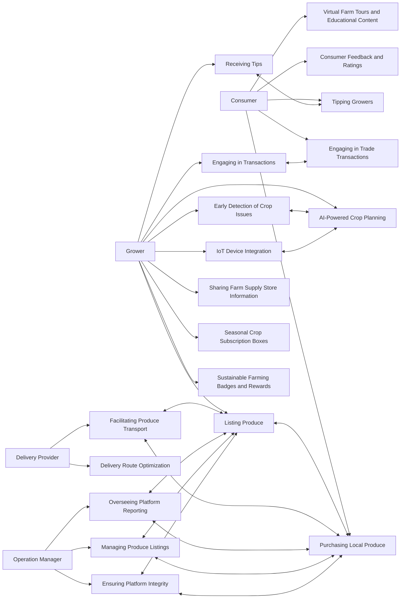
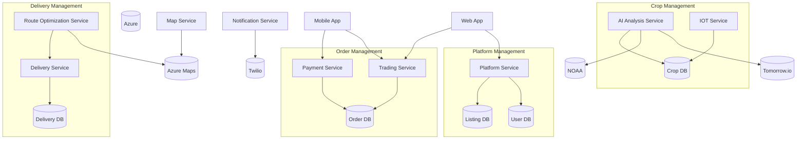

 # 🌱 Harvesit

Harvesit is a digital service that connects backyard growers and small farms directly with local consumers - making ultra-fresh produce accessible via mobile app.

Growers list upcoming harvests from gardens, orchards and fields in their neighborhood. AI-powered crop planning tools provide personalized guidance on planting. Computer vision detects pests early and identifies deficiencies.

Shoppers browse area offerings through an interactive map interface. Order whatever looks good for delivery or contactless pickup via the app. AI-driven healthy recipes adapt to available seasonal abundance.

Payment and logistics are managed seamlessly by the platform. Community members can flex roles from consumer to grower to delivery driver. Two-way ratings and reviews cultivate trust and transparency.

Part customizable farm box, part micro farmers’ market - Harvesit taps into hyperlocal harvests for maximum freshness. Reducing waste and emissions through smarter technology, shorter supply chains and stronger regional ties.

# :bulb: Why Harvesit? 

- Access the Freshest Food Grown Around the Corner  
     - Harvested right in your neighborhood
     
- Support Sustainable Local Food Systems   
     - Keep dollars circulating locally
     - Enable small-scale farms  
     - Promote biodiversity
     
- Reduce Food Waste and Emissions 
     - Connect unmarketed harvests to buyers
     - Slash supply chain miles
  
- Build Stronger Communities 
    - Know who grows your food   
    - Exchange skills and surplus harvests
    - Foster relationships around food
               
- Boost Local Economies
    - Increase regional self-reliance
    - Help bootstrap new farms 
    - Create jobs beyond growing food
            
- Cultivate the Next Generation of Farmers  
    - Inspire and train future producers
    - Share knowledge between generations

# ✨ Features

**Growers**

1. List Produce  
   - Grower logs into app and creates listings for produce that will be ready for harvest
   - Grower enters details like crop type, quantity available, expected harvest date, price, etc.   
   - Once listed, produce is automatically searchable by consumers
   
2. Sell Produce
   - Grower changes listing status to "Ready for Sale" when crop is ready for harvest
   - Payment is processed via app. Grower gets notified of new orders.
   
3. Trade Produce
   - Grower can propose a trade of their produce with other growers  
   - Other growers get notifications and can accept trade proposal
   - Pickup/drop-off logistics are arranged between growers
   
4. Find Farm Supply Stores
   - Map view shows farm supply stores in nearby locations
   - Growers can get directions, store hours, inventory availability etc.

5. Add Farm Supply Store
   - Growers can add new farm supply stores by entering address  
   - Added stores are pinned on map
   
6. Receive Buyer Tips
   - Consumers can provide monetary tips to growers during a sale 
   - Tips are transferred to grower after successful delivery

7. Crop Planning Suggestions 
   - Grower enters details on farm size, crops grown
   - AI algorithm provides personalized suggestions on optimal crops to grow based on soil type, climate etc.
   
8. Crop Issue Detection
   - Grower uploads plant photos through app
   - Computer vision AI detects presence of disease, pests etc.
   - Preventative advice is provided to grower if issues are found early
   
9. Environmental Monitoring
   - Grower sets up IoT sensors (provided by platform)
   - Sensors transmit temperature, humidity, soil moisture data
   - Data visualized in easy charts and graphs for the grower
   
**Consumers**

1. Search Produce
   - Consumer enters produce type  
   - Results show listings from nearby growers, sorted by harvest date  
   - Map view shows locations of growers pinned to map
   - Consumers can search by selecting area on map

2. Purchase Produce
   - Consumer selects a listing and confirms order
   - Payment processed via app. Grower is notified of the purchase. 
   - Consumer coordinates pickup/delivery with the grower
   - Consumers can provide tips to growers 

3. Healthy Recipe Suggestions
   - Based on current and upcoming produce listings from nearby growers 
   - AI algorithm provides healthy, simple recipe ideas
   
4. Rate and Review Growers
   - Consumers provide 1-5 star ratings on quality, service etc.
   - Reviews are public and help inform other consumers
   
**Delivery Providers**

1. Accept Delivery Job
   - Same users who act as consumers or growers can also sign up as delivery providers  
   - When a consumer purchases produce, nearby delivery providers get a notification 
   - Delivery provider can accept the delivery job in the app
   
2. Coordinate Pick-Up & Drop-Off
   - Accepting a job shares the grower's contact and location details
   - Delivery provider coordinates schedule for picking up produce
   - After pickup, delivery address is shown on map
   - Status updates in real-time for consumer and grower
   - Simple features to complete delivery when produce is handed off to consumer

**Platform Administrators**

1. Manage Produce Listings  
   - Create, update, delete produce types allowed to be listed
   - Ensure listings meet guidelines before publishing 
   - Remove inappropriate listings
   
2. Analytics Reporting
   - Key metrics like number of users, listings, sales volumes and values  
   - Reporting on trends for different crops, geographies
   - Inform decisions around improving platform features and functionality

# References
- https://github.com/markdown-templates/markdown-emojis
- https://docs.github.com/en/get-started/writing-on-github/working-with-advanced-formatting/creating-diagrams#creating-mermaid-diagrams

# Use Case Diagram

# First Principle Software Design

1. Writing self-documenting code boosts team velocity/morale and reduces costs. Carefully naming and structure code to express intent. This facilitates future maintenance and evolution to meet changing business needs.

2. Modular architecture enables flexible enhancement and scalability. Decompose software around business capabilities with stable interfaces that can scale independently. Optimize for current needs without overengineering. Balance meeting today's requirements with the ability to enhance later. Keep complexity manageable as capabilities expand over time.

3. Unify platforms/languages to maximize developer throughput. Eliminate context switching to enable deeper skill levels. This force multiplication means a unified team achieves greater velocity on strategic projects.

4. Automate testing/deployments to accelerate delivery and enhance quality. Shift developer focus towards writing business logic rather than manual QA/ops. The increased velocity and resilience pay continuous dividends.

5. Leverage cloud capabilities while sustaining core portability. Fully utilize managed services to increase productivity but loosely couple core logic from provider APIs. This focuses effort on valuable feature building rather than re-platforming. Prioritizing portable business logic delivers value quickly while retaining flexibility.

### Ultimately these principles aim to:
- Cut costs by reducing maintenance needs
- Speed up how fast we can add new capabilities
- Enable flexibility to adapt software in the future

# Technology stack

1. **Backend Services with .NET 8 and C# 12**: .NET 8 and C# 12 are excellent choices for backend development due to their robustness, scalability, and extensive community support. They also integrate seamlessly with other .NET ecosystem tools.

2. **Web Applications with Blazor .NET 8**: Blazor is a good choice for web applications, particularly for teams already proficient in C# and .NET. It allows for sharing code between server and client sides, enhancing consistency.

3. **Mobile Applications with MAUI .NET 8**: MAUI is a versatile framework for developing cross-platform mobile applications. It aligns well with the principle of unifying platforms and tools.

4. **Dapr.io for Even-driven Microservice Architecture**: Dapr.io is an excellent choice for a cloud-agnostic, containerized microservice architecture. It supports modularity and scalability.

5. **Azure Public Cloud**: Azure is a comprehensive cloud platform that supports the entire stack you’ve chosen. It offers a wide range of services and integrates well with .NET, Dapr, and other Microsoft technologies.

6. **Python for AI and ML Workloads**: Python is the industry standard for AI and ML, offering extensive libraries and community support.

7. **Azure RTOS and C++ for Embedded IoT Development**: Azure RTOS is a solid choice for real-time IoT applications, and C++ offers the performance needed for embedded systems.

8. **GitHub for Code Repositories and CI/CD Pipelines**: GitHub is a robust platform for version control and CI/CD, facilitating collaboration and automation in line with your principles.

9. **Azure CLI and Bicep for Infrastructure-as-Code (IaC)**: Azure CLI and Bicep are good choices for IaC, promoting automation and consistency in cloud resource management.

### Notes
- Solving a real problem for your user - rebuild local economy
- Fall in love with a problem. Specific
- Founder market fit - are you the right team to be working on this idea?
- How big is the market?
- How accute is this problem?
- Do you have competition?
- Do you want this personally and know someone what this?
- Recently possible or recently necessary?
- Are there good proxies for this business?
- Is it a good idea space?
- Look for things in the world that have changed recently that might have created for new opportunities
- Look for big insdustries that seem broken - local economy, local community, local food supply

## What is architecture?

- the shared understanding that the expert developers have of the system design.
- “the design decisions that need to be made early in a project” (irrevesible design decision)
- source: https://martinfowler.com/architecture/

- It's all about business context and needs

## How
- Focus on the most important characteristics and requirements to create a system that works and can last a long time. (how to identity these things?)
- Just enough upfront work
- Business needs, context, needs in the future
- Optimise for change. Architect for system with a need for change in mind.

### Hi there 👋

<!--
**harvesit/harvesit** is a ✨ _special_ ✨ repository because its `README.md` (this file) appears on your GitHub profile.

Here are some ideas to get you started:

- 🔭 I’m currently working on ...
- 🌱 I’m currently learning ...
- 👯 I’m looking to collaborate on ...
- 🤔 I’m looking for help with ...
- 💬 Ask me about ...
- 📫 How to reach me: ...
- 😄 Pronouns: ...
- ⚡ Fun fact: ...
-->
