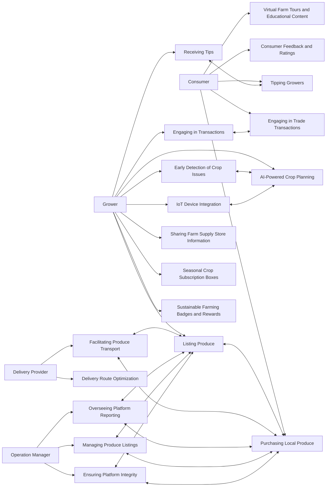

# 🌱 Harvesit App
Harvesit is a digital platform connecting local food producers directly to community consumers to transform local food systems. Operating like DoorDash and Airbnb, Harvesit brings convenience and modern tech to local agriculture and supply chains.

It allows small and large-scale growers to sell produce, benefiting from mobile and IoT tech to boost yields. This includes traditional farms along with backyard gardeners and hobbyists. Consumers enjoy purchasing and trading ultra-fresh, local food while learning about sustainability.

By facilitating commerce across the food ecosystem, Harvesit fosters self-reliant local economies and supplies. It promotes food production as a hobby and supplementary income source, enabling more participation in strengthening the community through transparency and mutually beneficial local trade.

Ultimately, Harvesit intertwines advanced technologies with community-building around local food systems that are nutritious, ecological, and socially-connected. The platform facilitates convenience for modern lifestyles while bringing people closer to nature and each other through sustainable local food.

# :exclamation: The Problem

In today's fast-paced, globalized world, local communities face significant challenges due to the disruptions in local economies and the modern lifestyle. The prevalence of mass-produced, imported food has led to a detachment from local agricultural sources, contributing to economic strain on small-scale growers and a decline in community cohesion. This detachment has also resulted in a diminished understanding and appreciation of sustainable, locally-sourced produce, further eroding the fabric of local food systems. Moreover, the modern lifestyle, characterized by convenience and speed, often overlooks the nutritional and environmental benefits of consuming fresh, locally-grown food.

# Why?

The importance of strong local economies:
- Rethinks the notion of endless economic "progress" and globalization as unrealistic and unsustainable goals
- Localization and self-reliant communities are more resilient and better able to withstand global disruptions
- Economic activity centered in communities invests back into those areas directly through jobs, infrastructure, services etc.
- Local systems build interdependencies and connections between community members, improving social fabric
- Local production and consumption has lower carbon footprint through minimized transport
- Communities can customize solutions to their unique contexts and needs
- Supports preservation of cultural heritage, identity, and diversity against homogenous globalized culture
- Allows prioritization of sustainability, wellbeing, and real quality of life rather than endless, abstract economic growth

# 🔭 Vision
Harvesit aims to transform local food systems by bringing community members together around fresh, sustainably grown produce. Our platform connects residents directly with area growers - from traditional farmers to backyard gardeners - facilitating commerce and mutual understanding. By making small-scale agriculture economically viable and letting individuals play an active role in their food supply, Harvesit strives to help towns achieve self-sufficiency and environmental resilience.  

We are working to build community resilience and self-reliance from the ground up, starting with food. As people grow closer to their food sources, Harvesit also lets them grow closer to nature and more connected with others doing the same. Our platform shortens the distance between growers and consumers both physically and relationally. This helps create local economies that promote transparency and trust. Integrating the latest technology with traditional growing methods, Harvesit serves as a model for balancing innovation with ecological limits.

If we can transform how towns are fed, we can transform our society. By combining an ethos of community interdependence with tools for independence from global systems, Harvesit aims to write a new chapter for thriving localised economies.

# ✨ Features (and suggestions)

### Growers:
1. **Listing Produce**: Growers use the platform to list various types of produce for sale, specifying quantity, price, and providing images.
2. **Engaging in Transactions**: Growers engage in trading, where they can exchange different types of produce with each other using the platform’s trade function.
3. **AI-Powered Crop Planning**: Growers upload soil data to receive AI suggestions on the most suitable types of produce to plant for the upcoming season.
4. **Early Detection of Crop Issues**: Growers can upload photos of their crops for AI-powered early detection of issues, receiving diagnostics and suggestions for corrective measures.
5. **IoT Device Integration**: Growers install IoT sensors in their growing areas to track environmental factors, feeding data to Harvesit for enhanced crop management advice.
6. **Receiving Tips**: Growers can receive monetary tips from buyers through the platform, fostering a supportive community environment.
7. **Sharing Farm Supply Store Information**: Growers contribute information about local farm supply stores, enhancing the community resource pool.
8. **Seasonal Crop Subscription Boxes**: Growers offer subscription services for assorted seasonal produce, promoting regular income and consumer exploration of diverse produce.
9. **Sustainable Farming Badges and Rewards**: The platform recognizes growers practicing sustainable and organic farming with badges and rewards, incentivizing environmentally friendly practices.

### Consumers:
1. **Purchasing Local Produce**: Consumers use the app to purchase various types of local produce from nearby growers.
2. **Tipping Growers**: Consumers have the option to tip growers, supporting and appreciating their efforts in sustainable agriculture.
3. **Engaging in Trade Transactions**: Consumers who are also growers can engage in trade transactions, exchanging their own produce with others.
4. **Consumer Feedback and Ratings**: Consumers provide feedback and ratings for their purchases, aiding in community-driven quality assurance.
5. **Virtual Farm Tours and Educational Content**: Consumers access virtual tours of local growing areas and educational content about sustainable farming practices.

### Delivery Providers:
1. **Facilitating Produce Transport**: Users can opt to become delivery providers, delivering a variety of produce from growers to consumers.
2. **Delivery Route Optimization**: The platform uses AI to optimize delivery routes for efficiency and reduced environmental impact.

### Map View:
1. **Searching for Produce on Map**: Consumers and growers can use the map view to locate various types of produce and growers within a specific radius.
2. **Locating Farm Supply Stores**: The map view also aids in finding the closest farm supply stores for various farming needs.

### Operation Managers:
1. **Overseeing Platform Reporting**: Operation Managers analyze transaction reports, focusing on the diversity and quality of produce transactions.
2. **Managing Produce Listings**: Operation managers are responsible for managing product listings, including creating, updating, and removing items. They must ensure that the platform is used correctly.
3. **Ensuring Platform Integrity**: They handle compliance issues, ensuring transactions adhere to platform guidelines.

### AI Features:
1. **AI-Driven Crop Suggestions**: Growers receive AI-based recommendations for planting, tailored to local conditions and sustainable practices.
2. **AI Photo Analysis for Crop Health**: The AI tool provides analysis of crop health issues, offering timely advice for growers.

### IoT Integration:
1. **Real-Time Data for AI Analysis**: Growers utilize real-time data from IoT devices for informed decision-making in crop management.

# References
- https://github.com/markdown-templates/markdown-emojis
- https://docs.github.com/en/get-started/writing-on-github/working-with-advanced-formatting/creating-diagrams#creating-mermaid-diagrams

# Use Case Diagram

### Notes
- Solving a real problem for your user - rebuild local economy
- Fall in love with a problem. Specific
- Founder market fit - are you the right team to be working on this idea?
- How big is the market?
- How accute is this problem?
- Do you have competition?
- Do you want this personally and know someone what this?
- Recently possible or recently necessary?
- Are there good proxies for this business?
- Is it a good idea space?
- Look for things in the world that have changed recently that might have created for new opportunities
- Look for big insdustries that seem broken - local economy, local community, local food supply

## What is architecture?

- the shared understanding that the expert developers have of the system design.
- “the design decisions that need to be made early in a project” (irrevesible design decision)
- source: https://martinfowler.com/architecture/

- It's all about business context and needs

## How
- Focus on the most important characteristics and requirements to create a system that works and can last a long time. (how to identity these things?)
- Just enough upfront work
- Business needs, context, needs in the future
- Optimise for change. Architect for system with a need for change in mind.

### Hi there 👋

<!--
**harvesit/harvesit** is a ✨ _special_ ✨ repository because its `README.md` (this file) appears on your GitHub profile.

Here are some ideas to get you started:

- 🔭 I’m currently working on ...
- 🌱 I’m currently learning ...
- 👯 I’m looking to collaborate on ...
- 🤔 I’m looking for help with ...
- 💬 Ask me about ...
- 📫 How to reach me: ...
- 😄 Pronouns: ...
- ⚡ Fun fact: ...
-->
