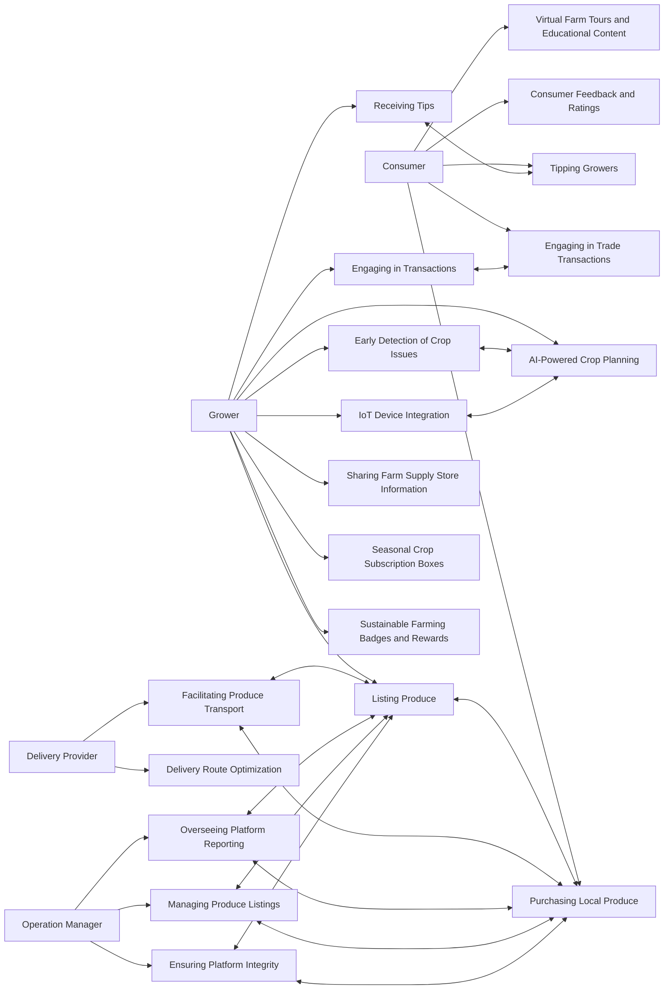

 # 🌱 Harvesit 📱 A Digital Platform Revitalizing Local Fresh Produce

Harvesit is an innovative digital platform designed to strengthen and transform localized fresh produce systems by directly connecting growers and consumers.

The platform provides powerful tools to simplify operations across the local fresh produce supply chain, including:

* Listing/ordering app that allows growers to directly showcase and sell or trade their fresh produce to the local community

* Delivery coordination features to seamlessly transport local fresh produce from field to table  

* Crop planning/management functionality leveraging AI and IoT to help improve fresh produce yields

Drawing inspiration from platforms like Airbnb and DoorDash, Harvesit combines modern technology with a mission-driven focus on revitalizing local fresh produce ecosystems through economic, social and environmental sustainability. 

By making small-scale, community-centric agriculture of nutritious local fresh produce easy, viable and rewarding for both producers and consumers, Harvesit aims to facilitate localized resilience, self-reliance and interconnection.

# 💔 Struggling Local Fresh Food Economies

Local fresh food systems face systemic challenges, including:

* Overreliance on mass-produced import foods, disconnecting communities from regional agricultural networks

* Economic hardship for small-scale local fresh produce growers

* Lost opportunities for community cohesion around nutritious, locally grown fresh produce

Additionally, modern lifestyles underappreciate qualities of fresh, sustainably-sourced local fresh produce:

* Nutrition and health benefits

* Environmental advantages of shortened supply chains

Harvesit fosters understanding and participation to address these struggles.

# 🔭 The Vision 🌠

**Bring the farm closer**

Harvesit’s vision is to connect each community member to their local fresh produce growers by shortening the physical and relational distance from farm to table.

**Cultivate flourishing localized economies**

By fostering robust ecosystems around locally-sourced food, Harvesit envisions towns and cities with thriving, resilient economies centered on sustainability.

**Foster a love for nature in our youth**

Through its engaging digital platform, Harvesit strives to bring passion for agriculture and a back-to-basics lifestyle to the next generation of growers by helping youth discover the wonders of nature and growing their own food.

**Bring neighbors together, from seed to table**

By connecting community members around locally cultivated food, Harvesit seeks to strengthen ties between residents while encouraging sustainable environmental practices.

# ✨ (Proposed) Features

### Growers:
1. **Listing Produce**: Growers use the platform to list various types of produce for sale, specifying quantity, price, and providing images.
2. **Engaging in Transactions**: Growers engage in trading, where they can exchange different types of produce with each other using the platform’s trade function.
3. **AI-Powered Crop Planning**: Growers upload soil data to receive AI suggestions on the most suitable types of produce to plant for the upcoming season.
4. **Early Detection of Crop Issues**: Growers can upload photos of their crops for AI-powered early detection of issues, receiving diagnostics and suggestions for corrective measures.
5. **IoT Device Integration**: Growers install IoT sensors in their growing areas to track environmental factors, feeding data to Harvesit for enhanced crop management advice.
6. **Receiving Tips**: Growers can receive monetary tips from buyers through the platform, fostering a supportive community environment.
7. **Sharing Farm Supply Store Information**: Growers contribute information about local farm supply stores, enhancing the community resource pool.
8. **Seasonal Crop Subscription Boxes**: Growers offer subscription services for assorted seasonal produce, promoting regular income and consumer exploration of diverse produce.
9. **Sustainable Farming Badges and Rewards**: The platform recognizes growers practicing sustainable and organic farming with badges and rewards, incentivizing environmentally friendly practices.

### Consumers:
1. **Purchasing Local Produce**: Consumers use the app to purchase various types of local produce from nearby growers.
2. **Tipping Growers**: Consumers have the option to tip growers, supporting and appreciating their efforts in sustainable agriculture.
3. **Engaging in Trade Transactions**: Consumers who are also growers can engage in trade transactions, exchanging their own produce with others.
4. **Consumer Feedback and Ratings**: Consumers provide feedback and ratings for their purchases, aiding in community-driven quality assurance.
5. **Virtual Farm Tours and Educational Content**: Consumers access virtual tours of local growing areas and educational content about sustainable farming practices.

### Delivery Providers:
1. **Facilitating Produce Transport**: Users can opt to become delivery providers, delivering a variety of produce from growers to consumers.
2. **Delivery Route Optimization**: The platform uses AI to optimize delivery routes for efficiency and reduced environmental impact.

### Map View:
1. **Searching for Produce on Map**: Consumers and growers can use the map view to locate various types of produce and growers within a specific radius.
2. **Locating Farm Supply Stores**: The map view also aids in finding the closest farm supply stores for various farming needs.

### Operation Managers:
1. **Overseeing Platform Reporting**: Operation Managers analyze transaction reports, focusing on the diversity and quality of produce transactions.
2. **Managing Produce Listings**: Operation managers are responsible for managing product listings, including creating, updating, and removing items. They must ensure that the platform is used correctly.
3. **Ensuring Platform Integrity**: They handle compliance issues, ensuring transactions adhere to platform guidelines.

### AI Features:
1. **AI-Driven Crop Suggestions**: Growers receive AI-based recommendations for planting, tailored to local conditions and sustainable practices.
2. **AI Photo Analysis for Crop Health**: The AI tool provides analysis of crop health issues, offering timely advice for growers.

### IoT Integration:
1. **Real-Time Data for AI Analysis**: Growers utilize real-time data from IoT devices for informed decision-making in crop management.

# References
- https://github.com/markdown-templates/markdown-emojis
- https://docs.github.com/en/get-started/writing-on-github/working-with-advanced-formatting/creating-diagrams#creating-mermaid-diagrams

# Use Case Diagram

# First Principle Software Design

1. Writing self-documenting code boosts team velocity/morale and reduces costs. Carefully naming and structure code to express intent. This facilitates future maintenance and evolution to meet changing business needs.

2. Modular architecture enables flexible enhancement and scalability. Decompose software around business capabilities with stable interfaces that can scale independently. Optimize for current needs without overengineering. Balance meeting today's requirements with the ability to enhance later. Keep complexity manageable as capabilities expand over time.

3. Unify platforms/languages to maximize developer throughput. Eliminate context switching to enable deeper skill levels. This force multiplication means a unified team achieves greater velocity on strategic projects.

4. Automate testing/deployments to accelerate delivery and enhance quality. Shift developer focus towards writing business logic rather than manual QA/ops. The increased velocity and resilience pay continuous dividends.

5. Leverage cloud capabilities while sustaining core portability. Fully utilize managed services to increase productivity but loosely couple core logic from provider APIs. This focuses effort on valuable feature building rather than re-platforming. Prioritizing portable business logic delivers value quickly while retaining flexibility.

### Ultimately these principles aim to:
- Cut costs by reducing maintenance needs
- Speed up how fast we can add new capabilities
- Enable flexibility to adapt software in the future

# Technology stack

1. **Backend Services with .NET 8 and C# 12**: .NET 8 and C# 12 are excellent choices for backend development due to their robustness, scalability, and extensive community support. They also integrate seamlessly with other .NET ecosystem tools.

2. **Web Applications with Blazor .NET 8**: Blazor is a good choice for web applications, particularly for teams already proficient in C# and .NET. It allows for sharing code between server and client sides, enhancing consistency.

3. **Mobile Applications with MAUI .NET 8**: MAUI is a versatile framework for developing cross-platform mobile applications. It aligns well with the principle of unifying platforms and tools.

4. **Dapr.io for Even-driven Microservice Architecture**: Dapr.io is an excellent choice for a cloud-agnostic, containerized microservice architecture. It supports modularity and scalability.

5. **Azure Public Cloud**: Azure is a comprehensive cloud platform that supports the entire stack you’ve chosen. It offers a wide range of services and integrates well with .NET, Dapr, and other Microsoft technologies.

6. **Python for AI and ML Workloads**: Python is the industry standard for AI and ML, offering extensive libraries and community support.

7. **Azure RTOS and C++ for Embedded IoT Development**: Azure RTOS is a solid choice for real-time IoT applications, and C++ offers the performance needed for embedded systems.

8. **GitHub for Code Repositories and CI/CD Pipelines**: GitHub is a robust platform for version control and CI/CD, facilitating collaboration and automation in line with your principles.

9. **Azure CLI and Bicep for Infrastructure-as-Code (IaC)**: Azure CLI and Bicep are good choices for IaC, promoting automation and consistency in cloud resource management.

### Notes
- Solving a real problem for your user - rebuild local economy
- Fall in love with a problem. Specific
- Founder market fit - are you the right team to be working on this idea?
- How big is the market?
- How accute is this problem?
- Do you have competition?
- Do you want this personally and know someone what this?
- Recently possible or recently necessary?
- Are there good proxies for this business?
- Is it a good idea space?
- Look for things in the world that have changed recently that might have created for new opportunities
- Look for big insdustries that seem broken - local economy, local community, local food supply

## What is architecture?

- the shared understanding that the expert developers have of the system design.
- “the design decisions that need to be made early in a project” (irrevesible design decision)
- source: https://martinfowler.com/architecture/

- It's all about business context and needs

## How
- Focus on the most important characteristics and requirements to create a system that works and can last a long time. (how to identity these things?)
- Just enough upfront work
- Business needs, context, needs in the future
- Optimise for change. Architect for system with a need for change in mind.

### Hi there 👋

<!--
**harvesit/harvesit** is a ✨ _special_ ✨ repository because its `README.md` (this file) appears on your GitHub profile.

Here are some ideas to get you started:

- 🔭 I’m currently working on ...
- 🌱 I’m currently learning ...
- 👯 I’m looking to collaborate on ...
- 🤔 I’m looking for help with ...
- 💬 Ask me about ...
- 📫 How to reach me: ...
- 😄 Pronouns: ...
- ⚡ Fun fact: ...
-->
