 # 🌱 Harvesit

Harvesit is a digital service that connects backyard growers and small farms directly with local consumers - making ultra-fresh produce accessible via mobile app.

Growers list upcoming harvests from gardens, orchards and fields in their neighborhood. AI-powered crop planning tools provide personalized guidance on planting. Computer vision detects pests early and identifies deficiencies.

Shoppers browse area offerings through an interactive map interface. Order whatever looks good for delivery or contactless pickup via the app. AI-driven healthy recipes adapt to available seasonal abundance.

Payment and logistics are managed seamlessly by the platform. Community members can flex roles from consumer to grower to delivery driver. Two-way ratings and reviews cultivate trust and transparency.

Part customizable farm box, part micro farmers’ market - Harvesit taps into hyperlocal harvests for maximum freshness. Reducing waste and emissions through smarter technology, shorter supply chains and stronger regional ties.

# :bulb: Why Harvesit? 

- Access the Freshest Food Grown Around the Corner  
     - Harvested right in your neighborhood 🍅🌽🥕
     
- Support Sustainable Local Food Systems   
     - Keep dollars circulating locally 💸
     - Enable small-scale farms 🚜
     - Promote biodiversity 🌱🌿🌞
     
- Reduce Food Waste and Emissions 
     - Connect unmarketed harvests to buyers 🍓🍐
     - Slash supply chain miles 🚛➡️
  
- Build Stronger Communities 
    - Know who grows your food 👨‍🌾👩‍🌾
    - Exchange skills and surplus harvests 🤝
    - Foster relationships around food 🥗
               
- Boost Local Economies
    - Increase regional self-reliance 📈
    - Help bootstrap new farms 🐓🌾
    - Create jobs beyond growing food 🧑‍💻
            
- Cultivate the Next Generation of Farmers  
    - Inspire and train future producers 👩‍🌾👨‍🌾
    - Share knowledge between generations 👵👦

# ✨ Features

**Growers**

1. List Produce  
   - Grower logs into app and creates listings for produce that will be ready for harvest
   - Grower enters details like crop type, quantity available, expected harvest date, price, etc.   
   - Once listed, produce is automatically searchable by consumers
   
2. Sell Produce
   - Grower changes listing status to "Ready for Sale" when crop is ready for harvest
   - Payment is processed via app. Grower gets notified of new orders.
   
3. Trade Produce
   - Grower can propose a trade of their produce with other growers  
   - Other growers get notifications and can accept trade proposal
   - Pickup/drop-off logistics are arranged between growers
   
4. Find Farm Supply Stores
   - Map view shows farm supply stores in nearby locations
   - Growers can get directions, store hours, inventory availability etc.

5. Add Farm Supply Store
   - Growers can add new farm supply stores by entering address  
   - Added stores are pinned on map
   
6. Receive Buyer Tips
   - Consumers can provide monetary tips to growers during a sale 
   - Tips are transferred to grower after successful delivery

7. Crop Planning Suggestions 
   - Grower enters details on farm size, crops grown
   - AI algorithm provides personalized suggestions on optimal crops to grow based on soil type, climate etc.
   
8. Crop Issue Detection
   - Grower uploads plant photos through app
   - Computer vision AI detects presence of disease, pests etc.
   - Preventative advice is provided to grower if issues are found early
   
9. Environmental Monitoring
   - Grower sets up IoT sensors (provided by platform)
   - Sensors transmit temperature, humidity, soil moisture data
   - Data visualized in easy charts and graphs for the grower
   
**Consumers**

1. Search Produce
   - Consumer enters produce type  
   - Results show listings from nearby growers, sorted by harvest date  
   - Map view shows locations of growers pinned to map
   - Consumers can search by selecting area on map

2. Purchase Produce
   - Consumer selects a listing and confirms order
   - Payment processed via app. Grower is notified of the purchase. 
   - Consumer coordinates pickup/delivery with the grower
   - Consumers can provide tips to growers 

3. Healthy Recipe Suggestions
   - Based on current and upcoming produce listings from nearby growers 
   - AI algorithm provides healthy, simple recipe ideas
   
4. Rate and Review Growers
   - Consumers provide 1-5 star ratings on quality, service etc.
   - Reviews are public and help inform other consumers
   
**Delivery Providers**

1. Accept Delivery Job
   - Same users who act as consumers or growers can also sign up as delivery providers  
   - When a consumer purchases produce, nearby delivery providers get a notification 
   - Delivery provider can accept the delivery job in the app
   
2. Coordinate Pick-Up & Drop-Off
   - Accepting a job shares the grower's contact and location details
   - Delivery provider coordinates schedule for picking up produce
   - After pickup, delivery address is shown on map
   - Status updates in real-time for consumer and grower
   - Simple features to complete delivery when produce is handed off to consumer

**Platform Administrators**

1. Manage Produce Listings  
   - Create, update, delete produce types allowed to be listed
   - Ensure listings meet guidelines before publishing 
   - Remove inappropriate listings
   
2. Analytics Reporting
   - Key metrics like number of users, listings, sales volumes and values  
   - Reporting on trends for different crops, geographies
   - Inform decisions around improving platform features and functionality

# Use Case Diagram

# Component Diagram

```mermaid
graph LR
    subgraph Interfaces
    WA[Web App - Administrators]
    MA[Mobile App - Users]
    end

    subgraph Event-Driven Microservices
    GS[Grower Services]
    CS[Consumer Services]
    DPS[Delivery Provider Services]
    AS[Administrator Services]
    end

    subgraph Core Services
    UAM[User Account Management]
    NS[Notification System]
    PP[Payment Processing]
    end

    subgraph Integrations
    AI[AI Integration]
    MI[Map Integration]
    EMI[Environmental Monitoring Integration]
    end

    subgraph Data Storage
    GSD[Grower Services Data]
    CSD[Consumer Services Data]
    DPSD[Delivery Provider Services Data]
    ASD[Administrator Services Data]
    end

    WA -->|Interacts with| AS
    MA -->|Interacts with| GS
    MA -->|Interacts with| CS
    MA -->|Interacts with| DPS

    GS -->|Event-driven communication| GSD
    CS -->|Event-driven communication| CSD
    DPS -->|Event-driven communication| DPSD
    AS -->|Event-driven communication| ASD

    UAM -->|Central to| GS
    UAM -->|Central to| CS
    UAM -->|Central to| DPS
    UAM -->|Central to| AS

    PP -->|Used by| GS
    PP -->|Used by| CS
    NS -->|Supports| AS
    NS -->|Supports| GS
    NS -->|Supports| CS
    NS -->|Supports| DPS

    AI -->|Used by| GS
    AI -->|Used by| CS
    MI -->|Used by| GS
    MI -->|Used by| CS
    EMI -->|Used by| GS

```

### Grower Services Component Diagram

### Consumer Services Component Diagram

### Delivery Service Component Diagram

### Platform Administrator Component Diagram

# First Principle Software Design

1. **Expressive Code**: Favor intuitive, self-documenting code aligned to business logic. This reduces maintenance costs.

2. **Unified Technology Stack**: Standardize programming languages, platforms and tools to improve team productivity.

3. **Domain-Driven Microservices**: Structure event-driven microservices around business domains for responsiveness.

4. **Containerized Deployment**: Containerize applications for consistency across environments enabling quick scaling.

5. **Automated Pipelines**: Implement automated testing and deployments for accelerated delivery at quality.

### Ultimately these principles aim to:
- Cut costs by reducing maintenance needs
- Speed up how fast we can add new capabilities
- Enable flexibility to adapt software in the future

# Technology stack

1. **Backend Services**: Adopt C# 12 with .NET 8 for non-AI/ML backend services, ensuring modern, efficient, and robust server-side logic.

2. **Microservices and Workloads**: Implement Dapr.io version 1.12 with Dapr Workflow for backend APIs, background tasks, and AI/ML workloads, promoting scalable and resilient microservices architecture.

3. **AI and ML Programming**: Use Python 3.11 for AI and ML tasks, leveraging its vast ecosystem and libraries for advanced data processing and machine learning.

4. **Backend Hosting**: Host Dapr backend applications on Azure Container Apps, benefiting from containerization and seamless scalability.

5. **Web UI Development**: Utilize .NET 8 Blazor Full-stack UI workload for crafting the Platform Administrator's Web application, enabling a consistent and interactive user interface.

6. **Web App Hosting**: Deploy Blazor web applications on Azure Web App, ensuring reliable and managed hosting services.

7. **Mobile App Development**: Utilize .NET 8 MAUI for mobile application development, offering a unified and cross-platform user experience.

8. **Source Control and CI/CD**: Integrate GitHub for code repositories and CI/CD pipelines, fostering collaborative development and automated workflows.

9. **Infrastructure Management**: Apply Bicep and Azure CLI for Infrastructure-as-Code, enabling efficient, reproducible, and version-controlled infrastructure provisioning.

10. **IoT Development**: Use C++ with Azure RTOS for Embedded IoT Development, ensuring high performance and real-time operations in IoT devices.

11. **IoT Cloud Gateway**: Utilize Azure IoT Hub as the Cloud IoT Gateway, managing device communication and data ingestion effectively.

12. **Cloud-Native Features**: Rely on Azure Cloud for cloud-native functionalities, including observability and security, to enhance application resilience and performance.

13. **Database Solution**: Leverage Azure Database for PostgreSQL, providing a robust, scalable, and managed relational database service.

14. **API Management**: Utilize Azure API Management as a gateway between backend microservices and client applications, offering API protection and distributed caching for optimized performance and security.

15. **User Access Management**: Implement Azure AD B2C for robust user access management. It provides identity and access management solutions, allowing for secure user authentication and authorization across web and mobile applications.
